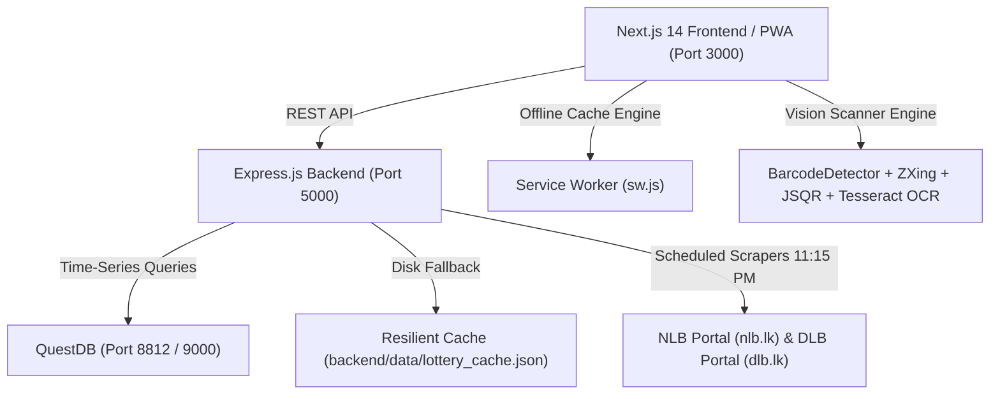
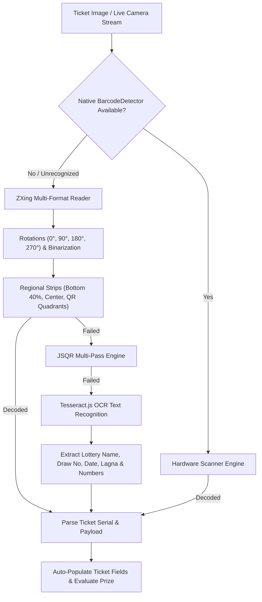

# 🎫 LottoScan — Full Project Documentation

**LottoScan** is an enterprise-grade Sri Lankan Lottery Management, Ticket Checking, High-Speed Bulk OCR Scanning, and Agency Order Distribution System. Built for lottery area agents, counter staff, mobile route sellers, and consumers, it features real-time draw result scrapers, multi-engine 1D/2D barcode & OCR scanning, automated prize evaluation across all 16 National Lotteries Board (NLB) & Development Lotteries Board (DLB) games, agency employee allocation spreadsheets, and full Progressive Web App (PWA) installability.

---

## 📑 Table of Contents
1. [System Architecture & Technology Stack](#1-system-architecture--technology-stack)
2. [Supported Sri Lankan Lotteries & Prize Rules](#2-supported-sri-lankan-lotteries--prize-rules)
3. [Core Functional Modules](#3-core-functional-modules)
   - [3.1 Home Portal & Interactive Lottery Grid (`/`)](#31-home-portal--interactive-lottery-grid-)
   - [3.2 Single Ticket Checker (`/check`)](#32-single-ticket-checker-check)
   - [3.3 High-Speed Bulk Ticket Scanner (`/scan`)](#33-high-speed-bulk-ticket-scanner-scan)
   - [3.4 Daily Orders & Commission Allocation (`/admin/orders`)](#34-daily-orders--commission-allocation-adminorders)
   - [3.5 Daily Winning Summary Report (`/admin/reports`)](#35-daily-winning-summary-report-adminreports)
   - [3.6 Progressive Web App (PWA) & Offline Engine](#36-progressive-web-app-pwa--offline-engine)
   - [3.7 Bi-Lingual Localization (English & Sinhala)](#37-bi-lingual-localization-english--sinhala)
4. [Agency Stock & Orders Calculation Formulas](#4-agency-stock--orders-calculation-formulas)
5. [Multi-Engine Barcode, QR & OCR Scanner Pipeline](#5-multi-engine-barcode-qr--ocr-scanner-pipeline)
6. [Data Storage & Resilient Cache Architecture](#6-data-storage--resilient-cache-architecture)
7. [API Reference & Endpoints](#7-api-reference--endpoints)
8. [Project Directory Structure](#8-project-directory-structure)
9. [Installation & Developer Setup Guide](#9-installation--developer-setup-guide)

---

## 1. System Architecture & Technology Stack



### Technology Highlights
- **Frontend Framework**: Next.js 14 with App Router, React 18, TypeScript.
- **Styling & UI**: Tailwind CSS, CSS Grid/Flexbox, Lucide React Icons, Canvas-Confetti, Web Audio API for scanner feedback chimes.
- **Backend Framework**: Node.js, Express.js, Axios, Cheerio (DOM scraping), CORS, JSON Web Token (JWT) authentication.
- **Database & Storage**:
  - **QuestDB**: Append-optimized time-series SQL database with PostgreSQL wire compatibility.
  - **Resilient Disk Cache**: `backend/data/lottery_cache.json` for zero-downtime offline continuity when QuestDB is disconnected.
- **Scanning & Computer Vision**:
  - Native Hardware `BarcodeDetector` API.
  - `@zxing/library` Multi-Format Barcode & QR Reader.
  - `jsqr` with regional adaptive thresholding.
  - `tesseract.js` OCR text recognition fallback for damaged or creased tickets.
- **Export & Reporting**: `jspdf` & `html2canvas` for PDF exports and native browser print styles (`@media print`).

---

## 2. Supported Sri Lankan Lotteries & Prize Rules

LottoScan provides 100% complete rule evaluation and prize calculation for all 16 official Sri Lankan lotteries:

### Development Lotteries Board (DLB)
| # | Lottery Name | Draw Frequency | Ball Format | Special Rules / Tiers |
|:-:|:---|:---:|:---:|:---|
| 1 | **Ada Kotipathi** | Daily | 4 Numbers (01-99) + Letter | Jackpot, 4 Numbers, 3 Numbers + Letter, 3 Numbers, 2 Numbers + Letter, 2 Numbers, 1 Number + Letter, Letter Only |
| 2 | **Shanida** | Daily | 4 Numbers + Letter | Super Number + Letter matching, 4 Numbers, 3 Numbers + Letter, Rs. 20 to Jackpot |
| 3 | **Lagna Wasanawa** | Daily | 4 Numbers + Zodiac / Lagna Sign | 12 Zodiac signs (*Mesha* to *Meena*); Lagna matching multiplier tiers |
| 4 | **Super Ball** | Daily | 4 Numbers + Letter | Special Super Bonus Tier |
| 5 | **Kapruka** | Daily | 4 Numbers + Letter | Matching multiplier payouts |
| 6 | **Sasiri** | Daily | 4 Numbers + Letter | Multi-tier prize ladder |
| 7 | **Supiri Dhana Sampatha** | Weekly | 4 Numbers + Letter | High-tier jackpot structure |
| 8 | **Jaya Sampatha** | Daily | 4 Single Digits (0-9) + Letter | 4-Digit box format |

### National Lotteries Board (NLB)
| # | Lottery Name | Draw Frequency | Ball Format | Special Rules / Tiers |
|:-:|:---|:---:|:---:|:---|
| 9 | **Govisetha** | Daily | 4 Numbers + Letter | Agricultural jackpot & Rs. 40 to Rs. 100,000 tiers |
| 10 | **Mahajana Sampatha** | Daily | 4 Numbers + Letter | Flagship NLB lottery, multi-tier prize structure |
| 11 | **Mega Power** | Daily | 4 Numbers + Letter | Mega multiplier rules |
| 12 | **Dhana Nidhanaya** | Daily | 4 Numbers + Letter | Special fortune tiers |
| 13 | **Handahana** | Daily | 4 Numbers + Zodiac Sign | Astrological Lagna matching |
| 14 | **NLB Jaya** | Daily | 4 Single Digits (0-9) + Letter | Single-digit fast draws |
| 15 | **Ada Sampatha** | Daily | **9-Digit Pyramid (2-3-4) + Letter** | **Unique 3-tier pyramid evaluation** |
| 16 | **Suba Dawasak** | Daily | 4 Numbers + Letter | Daily morning fortune draw |

---

## 3. Core Functional Modules

### 3.1 Home Portal & Interactive Lottery Grid (`/`)
- **Live Featured Draws**: Shows current jackpot amounts, draw numbers, draw dates, and winning numbers with zodiac ball visualization.
- **Board Filter Tabs**: Instant filtering by **All Lotteries**, **NLB (National)**, and **DLB (Development)**.
- **Winning Prize Ladders**: Complete breakdown of prize tiers for every lottery (from Rs. 20 / Rs. 40 consolation tiers up to multi-million Jackpots).
- **Search & Quick Actions**: Search any lottery by name with direct buttons to Check, Bulk Scan, or View History.

### 3.2 Single Ticket Checker (`/check`)
- **Dynamic Adaptive Layout**: Reconfigures input boxes based on selected lottery (e.g. 5 boxes for standard draws, 4 boxes for single-digit draws, 9-box pyramid for Ada Sampatha).
- **Interactive Zodiac / Lagna Selector**: Astrological sign picker showing English, transliteration, and Sinhala names (*Mesha / Aries / මේෂ*).
- **Instant Prize Result**: Highlights winning balls in green, calculates exact prize tier, payout amount in Rs., and claim instructions.

### 3.3 High-Speed Bulk Ticket Scanner (`/scan`)
Designed for high-volume lottery counter operators and area agents:
1. **4 Ingestion Modes**:
   - 📹 **Continuous Live Camera Scanner**: Auto-scan loop with visual alignment boxes, green flash animation, audio chime, and 2.5s deduplication buffer for hands-free scanning.
   - 🖼️ **Multi-Image Batch Upload**: Upload up to 50 ticket photos at once with parallel OCR & barcode processing.
   - 🔫 **Barcode Scanner Gun Mode**: Keyboard wedge listener capturing rapid inputs from physical USB / Bluetooth laser scanner guns.
   - ⌨️ **Rapid Manual Entry**: Quick fallback entry for damaged, creased, or torn tickets.
2. **Batch Itemized Table**: Instant computation of Total Scanned, Total Winning Tickets, Total Prize Value (Rs.), and Board Breakdown.
3. **1-Click Claims Recording**: Allocate verified winning tickets to specific counter staff or mobile sellers, syncing with the Daily Winning Summary Report (`/admin/reports`).

### 3.4 Daily Orders & Commission Allocation (`/admin/orders`)
Enables area lottery agencies to allocate tickets day-by-day to counter staff and mobile route sellers:
- **2D Day-by-Day Allocation Matrix**: Rows represent lotteries (NLB & DLB), columns represent registered employees/sellers.
- **5 Top KPI Metric Cards**:
  1. **Total Tickets**: Total allocated tickets after adding additional tickets ($\text{Ordered} + \text{Additional}$).
  2. **Remaining Tickets**: Day remaining unsold tickets.
  3. **Return Tickets**: Unsold returned tickets.
  4. **Net Sold Tickets**: Final tickets sold by sellers.
  5. **Total Payable (@ Rs. 35)**: Total sales value and seller commission.
- **Reconciliation Table Footer**:
  - `TOTAL ORDERED`: Initial lottery allocation counts.
  - `ADDITIONAL TICKETS`: Input for extra tickets given to each seller.
  - `TOTAL TICKETS`: Total tickets after adding additional tickets ($\text{Ordered} + \text{Additional}$).
  - `REMAINING TICKETS`: Input for remaining tickets.
  - `RETURNS`: Input for returned tickets.
  - `NET SOLD`: Final sold count ($\text{Total Tickets} - \text{Remaining} - \text{Returns}$).
  - `COMMISSION RATE (RS./TKT)`: Configurable rate per seller (e.g. Rs. 2.50, Rs. 2.00).
  - `COMMISSION`: Net sold tickets $\times$ commission rate.
  - `TOTAL PAYABLE (@ RS. 35)`: Net sold tickets $\times$ Rs. 35.
- **Employee Management**:
  - Modal to Add New Sellers (with name, counter/route identifier, and custom commission rate).
  - Modal to Manage & Delete active sellers.
- **Printable Distribution Sheet**: Clean layout formatted with formal Dispatcher, Agent Approval, and Cash Settlement signature sections.

### 3.5 Daily Winning Summary Report (`/admin/reports`)
Official daily payout audit and reconciliation report for NLB & DLB agencies:
- **Board-Wise Summaries (DLB & NLB)**: 3-column financial tables showing Prize Value, Quantity, and Total Payout.
- **Synced Agency Metrics**: Commission calculated from Daily Orders, active seller counts, and disbursed cash reconciliation.
- **Staff Performance & Audit Logs**: Detailed breakdown of tickets handled and payouts disbursed per staff member.
- **Official Print & PDF Layout**: Clean printable document with signature and seal blocks.

### 3.6 Progressive Web App (PWA) & Offline Engine
- **Standalone App Installation**: Installable directly on Windows, macOS, Android, and iOS.
- **Smart Install Button**: Integrated into Navbar and Mobile Drawer with iOS Safari guide modal.
- **Offline Service Worker (`sw.js`)**:
  - Precaches core app shells (`/`, `/check`, `/scan`, `/results`, `/admin/orders`, `/admin/reports`).
  - Cache-first strategy for scripts, fonts, and static assets.
  - Network-first with cached JSON fallback for lottery results.
  - Real-time offline indicator banner when connection drops.

### 3.7 Bi-Lingual Localization (English & Sinhala)
- Language switcher in the top navigation bar.
- English (`GB English`) and Sinhala (`LK සිංහල`) translations for all navigation, headings, draw dates, buttons, and instructional content.

---

## 4. Agency Stock & Orders Calculation Formulas

### 1. Total Tickets (After Adding Additional)
$$\text{Total Tickets} = \text{Total Ordered} + \text{Total Additional}$$

### 2. Net Sold Tickets
$$\text{Net Sold} = \text{Total Tickets} - \text{Remaining Tickets} - \text{Return Tickets}$$
$$\text{Net Sold} = (\text{Ordered} + \text{Additional}) - \text{Remaining} - \text{Returns}$$

### 3. Seller Commission
$$\text{Commission} = \text{Net Sold} \times \text{Commission Rate (Rs./Ticket)}$$
*(Default: Rs. 2.50 or Rs. 2.00 per sold ticket, fully customizable per seller)*

### 4. Total Payable (Ticket Value @ Rs. 35)
$$\text{Total Payable} = \text{Net Sold} \times \text{Rs. 35}$$

---

## 5. Multi-Engine Barcode, QR & OCR Scanner Pipeline



---

## 6. Data Storage & Resilient Cache Architecture

LottoScan implements dual-layer storage for maximum reliability:

1. **QuestDB Time-Series Engine**:
   - High-throughput append-optimized tables (`lottery_results`, `daily_orders`, `employees`, `claims`).
   - PostgreSQL wire protocol support on port `8812`.
2. **Resilient Local Disk Cache (`backend/data/lottery_cache.json`)**:
   - When QuestDB is active, all scraped draws and updates persist to both database and disk.
   - If QuestDB is stopped or disconnected, the backend seamlessly switches to disk cache, ensuring zero disruptions for frontend users.

---

## 7. API Reference & Endpoints

### Lottery & Results API (`/api/lottery`)
- `GET /api/lottery/results` — Fetch latest lottery results with optional `date` and `board` filters.
- `POST /api/lottery/check` — Evaluate a single ticket against official draw results.
- `POST /api/lottery/batch-check` — Evaluate an array of tickets in parallel with board breakdowns.
- `POST /api/lottery/scrape` — Trigger manual real-time scraping of NLB & DLB portals.

### Agency & Orders API (`/api/agent`)
- `GET /api/agent/orders?date=YYYY-MM-DD` — Retrieve 2D daily employee order matrix and commissions.
- `POST /api/agent/orders` — Save/update daily order quantities, additions, remaining, returns, and custom commission rates.
- `GET /api/agent/reports/daily?date=YYYY-MM-DD` — Retrieve aggregated daily winning summary report.
- `GET /api/agent/employees` — List all active agency staff members.
- `POST /api/agent/employees` — Register a new seller or counter staff.
- `DELETE /api/agent/employees/:id` — Soft-delete / remove an employee.
- `GET /api/agent/claims?date=YYYY-MM-DD` — Retrieve verified winning ticket claims.
- `POST /api/agent/claims` — Record a new winning ticket payout claim.

---

## 8. Project Directory Structure

```
lotto-scan/
├── backend/
│   ├── config/             # Database & environment configurations
│   ├── controllers/        # Request handlers (lottery, agent, orders, claims)
│   ├── data/
│   │   └── lottery_cache.json # Resilient local disk cache
│   ├── models/             # Data models (Employee, Order, Claim, Result)
│   ├── routes/             # Express API routes
│   ├── scrapers/           # NLB & DLB web scrapers
│   ├── services/           # Business logic & prize evaluation engine
│   ├── server.js           # Express application entry point
│   └── package.json
├── lottoscan-web-frontend/
│   ├── public/             # Static assets, icons, manifest.json, sw.js
│   ├── src/
│   │   ├── app/            # Next.js 14 App Router pages
│   │   │   ├── page.tsx            # Home portal & live results
│   │   │   ├── check/page.tsx      # Single ticket checker
│   │   │   ├── scan/page.tsx       # High-speed bulk scanner
│   │   │   ├── admin/
│   │   │   │   ├── dashboard/      # Admin overview
│   │   │   │   ├── orders/page.tsx # Daily orders & commission allocation
│   │   │   │   └── reports/        # Daily winning summary report
│   │   │   └── layout.tsx
│   │   ├── components/     # Reusable React components
│   │   │   ├── layout/     # Navbar, Footer
│   │   │   ├── sections/   # LotteryGrid, HeroBanner
│   │   │   ├── ui/         # Button, Card, Badge, Modal, ZodiacBall
│   │   │   └── pwa/        # PWARegistration, InstallButton
│   │   ├── contexts/       # LanguageContext (English / Sinhala)
│   │   ├── lib/            # Utility functions & API clients
│   │   └── types/          # TypeScript interface definitions
│   └── package.json
├── docker-compose.yml       # Containerized setup for QuestDB & services
├── PROJECT_DOCUMENTATION.md # Full project documentation
└── README.md               # Quickstart guide
```

---

## 9. Installation & Developer Setup Guide

### Prerequisites
- **Node.js**: v18.0.0 or higher
- **npm**: v8.0.0 or higher
- **QuestDB** (Optional, backend falls back automatically to local cache):
  ```bash
  docker run -p 9000:9000 -p 8812:8812 questdb/questdb
  ```

### Starting the Backend Server
```bash
cd backend
npm install
node server.js
# API Server runs on http://localhost:5000
```

### Starting the Frontend Web App & PWA
```bash
cd lottoscan-web-frontend
npm install
npm run dev
# Web application runs on http://localhost:3000
```

### Accessing the Application
- **Main Portal**: `http://localhost:3000/`
- **Single Checker**: `http://localhost:3000/check`
- **Bulk Scanner**: `http://localhost:3000/scan`
- **Daily Orders Sheet**: `http://localhost:3000/admin/orders`
- **Winning Summary Report**: `http://localhost:3000/admin/reports`
