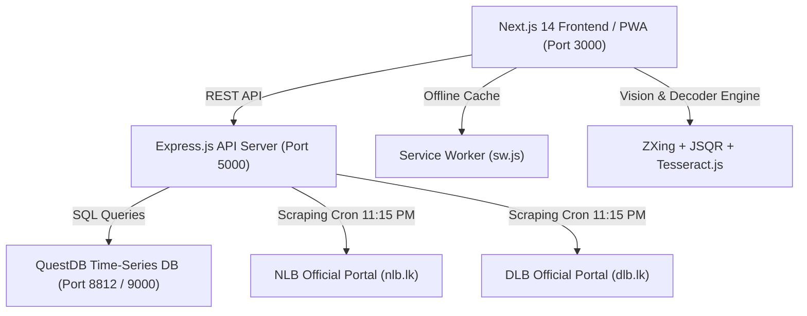
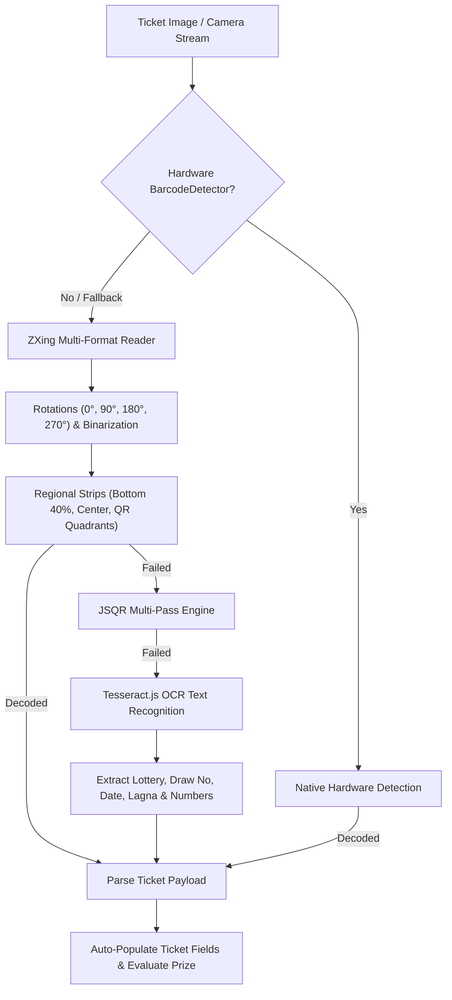

# 🎫 LottoScan — Complete Project Documentation

**LottoScan** is an enterprise-grade Sri Lankan Lottery Ticket Checking, Bulk Scanning, and Distribution Management System built for lottery agents, counter staff, mobile sellers, and consumers. It features real-time draw result scrapers, multi-engine 1D/2D barcode & OCR scanning, automated prize evaluation across all 16 National Lotteries Board (NLB) & Development Lotteries Board (DLB) games, agency employee order allocation sheets, and full Progressive Web App (PWA) installability.

---

## 📑 Table of Contents
1. [System Architecture & Technology Stack](#1-system-architecture--technology-stack)
2. [Supported Sri Lankan Lotteries & Prize Structures](#2-supported-sri-lankan-lotteries--prize-structures)
3. [Core Functional Modules & Features](#3-core-functional-modules--features)
   - [3.1 Home Portal & Draw Explorer (`/`)](#31-home-portal--draw-explorer-)
   - [3.2 Single Ticket Checker (`/check`)](#32-single-ticket-checker-check)
   - [3.3 High-Speed Bulk Ticket Scanner (`/scan`)](#33-high-speed-bulk-ticket-scanner-scan)
   - [3.4 Daily Orders & Commission Allocation (`/admin/orders`)](#34-daily-orders--commission-allocation-adminorders)
   - [3.5 Daily Winning Summary Report (`/admin/reports`)](#35-daily-winning-summary-report-adminreports)
   - [3.6 Progressive Web App (PWA) & Offline Engine](#36-progressive-web-app-pwa--offline-engine)
   - [3.7 Bi-Lingual Localization (English & Sinhala)](#37-bi-lingual-localization-english--sinhala)
4. [Multi-Engine Barcode, QR & OCR Scanner Pipeline](#4-multi-engine-barcode-qr--ocr-scanner-pipeline)
5. [Database Schema & QuestDB Integration](#5-database-schema--questdb-integration)
6. [API Reference & Endpoints](#6-api-reference--endpoints)
7. [Installation & Developer Setup Guide](#7-installation--developer-setup-guide)

---

## 1. System Architecture & Technology Stack



### Technology Highlights
- **Frontend**: Next.js 14 (App Router), TypeScript, Tailwind CSS, Lucide Icons, Web Audio API.
- **Backend**: Node.js, Express.js, Axios, Cheerio (web scraping), JWT Authentication.
- **Database**: QuestDB (High-throughput append-optimized database with PostgreSQL wire compatibility).
- **Vision & Scanning**: Hardware `BarcodeDetector`, ZXing Multi-Format Reader, JSQR with adaptive binarization, Tesseract.js OCR.
- **PWA Engine**: Custom Service Worker with multi-strategy caching (Cache-First, Network-First, Offline Fallback).

---

## 2. Supported Sri Lankan Lotteries & Prize Structures

LottoScan provides 100% complete rule evaluation and prize calculation for all 16 official Sri Lankan lotteries:

### Development Lotteries Board (DLB)
| Lottery Name | Draw Frequency | Ball Format | Special Feature |
| :--- | :--- | :--- | :--- |
| **Ada Kotipathi** | Daily | 4 Numbers (01-99) + English Letter | Jackpots + Rs. 100 to Rs. 2,000,000 tiers |
| **Shanida** | Daily | 4 Numbers + English Letter | Super Number + Letter matching |
| **Lagna Wasanawa** | Daily | 4 Numbers + Zodiac / Lagna Sign | 12 Zodiac signs (*Mesha* to *Meena*) |
| **Super Ball** | Daily | 4 Numbers + English Letter | Special Super Bonus Tier |
| **Kapruka** | Daily | 4 Numbers + English Letter | Matching multiplier payouts |
| **Sasiri** | Daily | 4 Numbers + English Letter | Multi-tier prize ladder |
| **Supiri Dhana Sampatha** | Weekly | 4 Numbers + English Letter | High-tier jackpot structure |
| **Jaya Sampatha** | Daily | 4 Single Digits (0-9) + Letter | 4-Digit box format |

### National Lotteries Board (NLB)
| Lottery Name | Draw Frequency | Ball Format | Special Feature |
| :--- | :--- | :--- | :--- |
| **Govisetha** | Daily | 4 Numbers + English Letter | Agricultural jackpot & Rs. 40 to Rs. 100,000 tiers |
| **Mahajana Sampatha** | Daily | 4 Numbers + English Letter | Flagship NLB lottery |
| **Mega Power** | Daily | 4 Numbers + English Letter | Mega multiplier rules |
| **Dhana Nidhanaya** | Daily | 4 Numbers + English Letter | Special fortune tiers |
| **Handahana** | Daily | 4 Numbers + Zodiac Sign | Astrological Lagna matching |
| **NLB Jaya** | Daily | 4 Single Digits (0-9) + Letter | Single-digit fast draws |
| **Ada Sampatha** | Daily | **9-Digit Pyramid (2-3-4) + Letter** | **Unique 3-tier pyramid evaluation** |
| **Suba Dawasak** | Daily | 4 Numbers + English Letter | Daily morning fortune draw |

---

## 3. Core Functional Modules & Features

### 3.1 Home Portal & Draw Explorer (`/`)
- **Live Featured Draws Banner**: Shows jackpot amounts, latest draw numbers, and scheduled draw dates.
- **Board Filter Tabs**: Instantly toggle between **All Lotteries**, **NLB (National)**, and **DLB (Development)**.
- **Search & Quick Action Cards**: Search any lottery by name with direct buttons to Check, Bulk Scan, or View History.

---

### 3.2 Single Ticket Checker (`/check`)
- **Dynamic Adaptive Input Layout**:
  - Automatically reconfigures input boxes based on selected lottery (e.g. 5 boxes for standard 2-digit draws, 4 boxes for NLB Jaya, and 9-box 3-tier pyramid for Ada Sampatha).
- **Zodiac / Lagna Selector**: Interactive astrological sign picker displaying English names, transliterations, and Sinhala names (*Mesha / Aries / මේෂ*).
- **Instant Result Card**: Highlights matching balls in green, shows matched Lagna verification badge, matched tier name, prize in Rs., and claim instructions.

---

### 3.3 High-Speed Bulk Ticket Scanner (`/scan`)
Designed for high-volume lottery counter operators and area agents to check batches of tickets rapidly:
1. **4 Ingestion Modes**:
   - 📹 **Continuous Live Camera Scanner**: Auto-scan loop with visual guidelines, green flash, audio chime feedback, and 2.5s deduplication buffer so tickets can be scanned continuously without touching the device.
   - 🖼️ **Multi-Image Batch Upload**: Upload up to 50 ticket photos at once with parallel OCR & barcode processing.
   - 🔫 **Barcode Scanner Gun Mode**: Keyboard wedge listener capturing rapid inputs from physical USB / Bluetooth laser scanner guns.
   - ⌨️ **Rapid Manual Entry**: Quick entry for creased, torn, or damaged tickets.
2. **Live Itemized Batch Table**:
   - Instant calculation of Total Scanned, Total Winning Tickets, Total Prize Value (Rs.), and Board Breakdown (NLB vs DLB).
3. **1-Click Winning Claims Sync**:
   - Click **"📥 Record Winning Claims"** to allocate verified winning tickets to specific counter staff/sellers, directly updating the Daily Winning Summary Report (`/admin/reports`).
4. **Export & Print**:
   - Printable physical batch audit sheet and CSV download.

---

### 3.4 Daily Orders & Commission Allocation (`/admin/orders`)
Enables area lottery agencies to allocate tickets day-by-day to counter staff and mobile route sellers:
- **2D Day-by-Day Allocation Matrix**: Rows represent lotteries (NLB & DLB), columns represent registered employees/sellers.
- **Automated Commission Calculations**:
  - Commission calculated automatically: $\text{Commission} = (\text{Ordered Tickets} - \text{Returns}) \times \text{Rate}$
  - Configurable commission rate per seller (e.g. Rs. 2.50 or Rs. 2.00 per ticket).
- **Unsold Ticket Returns Tracking**: Deducts returns from total allocation to calculate net sold tickets.
- **Seller Management**: Add new staff, customize counters, and remove/delete sellers.
- **Printable Distribution Sheet**: Clean layout formatted for physical agency distribution and seller signatures.

---

### 3.5 Daily Winning Summary Report (`/admin/reports`)
Official daily payout audit and reconciliation report for NLB & DLB agencies:
- **Board-Wise Summaries (DLB & NLB)**: Clean 3-column financial tables:
  1. Winning Prize Value (*Rs. 100, Rs. 1,000, Rs. 2,000, Rs. 50,000*, etc.)
  2. Winning Tickets (Qty)
  3. Total Payout Amount (Rs.)
- **Subtotal Rows**: Subtotal ticket count and cash disbursed per board.
- **Synced Agency Metrics**:
  - **Agency Commission**: Reflects the exact day-by-day seller commission calculated from the Daily Orders page.
  - **Active Staff Members**: Real-time count of active agency sellers.
- **Staff Performance & Audit Logs**: Detailed breakdown of tickets handled and payouts disbursed per staff member.
- **Official Print & PDF Layout**: Clean printable document with signature and seal blocks for Counter Staff, Area Agent, and NLB/DLB Certification.

---

### 3.6 Progressive Web App (PWA) & Offline Engine
- **Standalone App Installation**: Installable directly on Windows, macOS, Android, and iOS.
- **Smart Install Button**: Integrated into the Navbar and Mobile Drawer with iOS Safari guide modal.
- **Offline Service Worker (`sw.js`)**:
  - Precaches core app shells (`/`, `/check`, `/scan`, `/results`, `/admin/orders`, `/admin/reports`).
  - Cache-first strategy for scripts, fonts, and assets.
  - Network-first with cached JSON fallback for lottery results.
  - Real-time offline indicator banner when connection drops.
- **App Shortcuts**: Quick jump actions on right-click / long-press:
  - ⚡ *Bulk Scanner* (`/scan`)
  - 🔍 *Check Ticket* (`/check`)
  - 📦 *Daily Orders* (`/admin/orders`)
  - 📊 *Winning Reports* (`/admin/reports`)

---

### 3.7 Bi-Lingual Localization (English & Sinhala)
- Full language switcher in the top navigation bar.
- English (`GB English`) and Sinhala (`LK සිංහල`) translations for all navigation, headings, draw dates, buttons, and instructional content.

---

## 4. Multi-Engine Barcode, QR & OCR Scanner Pipeline



---

## 5. Database Schema & QuestDB Integration

LottoScan uses **QuestDB** for high-speed time-series and append-optimized data storage:

### 1. `lottery_results` Table
Stores official scraped draw results:
```sql
CREATE TABLE lottery_results (
    id SYMBOL,
    lottery_name SYMBOL,
    board SYMBOL,
    draw_number INT,
    draw_date TIMESTAMP,
    winning_numbers STRING,
    letter SYMBOL,
    zodiac SYMBOL,
    jackpot_amount DOUBLE,
    created_at TIMESTAMP
) TIMESTAMP(created_at);
```

### 2. `daily_orders` Table
Stores seller ticket allocations, returns, and commission rates:
```sql
CREATE TABLE daily_orders (
    id SYMBOL,
    agent_id SYMBOL,
    order_date TIMESTAMP,
    employee_id SYMBOL,
    employee_name STRING,
    lottery_name SYMBOL,
    board SYMBOL,
    ordered_qty INT,
    returned_qty INT,
    commission_rate DOUBLE,
    created_at TIMESTAMP
) TIMESTAMP(created_at);
```

### 3. `employees` Table
Stores agency staff and mobile seller profiles:
```sql
CREATE TABLE employees (
    id SYMBOL,
    agent_id SYMBOL,
    name STRING,
    phone STRING,
    email STRING,
    counter_name STRING,
    commission_rate DOUBLE,
    status SYMBOL,
    created_at TIMESTAMP
) TIMESTAMP(created_at);
```

### 4. `claims` Table
Stores verified customer winning payout claims:
```sql
CREATE TABLE claims (
    id SYMBOL,
    agent_id SYMBOL,
    employee_id SYMBOL,
    employee_name STRING,
    lottery_name SYMBOL,
    board SYMBOL,
    draw_number STRING,
    draw_date TIMESTAMP,
    ticket_serial STRING,
    matched_tier STRING,
    prize_amount DOUBLE,
    payout_status SYMBOL,
    created_at TIMESTAMP
) TIMESTAMP(created_at);
```

---

## 6. API Reference & Endpoints

### Lottery & Results API (`/api/lottery`)
- `GET /api/lottery/results` — Fetch latest lottery results with optional date and board filters.
- `POST /api/lottery/check` — Evaluate a single ticket against official draw results.
- `POST /api/lottery/batch-check` — Evaluate an array of tickets in parallel with board breakdowns.
- `POST /api/lottery/scrape` — Trigger manual real-time scraping of NLB & DLB portals.

### Agency & Orders API (`/api/agent`)
- `GET /api/agent/orders?date=YYYY-MM-DD` — Retrieve 2D daily employee order matrix and commissions.
- `POST /api/agent/orders` — Save/update daily order quantities, returns, and custom commission rates.
- `GET /api/agent/reports/daily?date=YYYY-MM-DD` — Retrieve aggregated daily winning summary report.
- `GET /api/agent/employees` — List all active agency staff members.
- `POST /api/agent/employees` — Register a new seller or counter staff.
- `DELETE /api/agent/employees/:id` — Soft-delete / remove an employee.
- `GET /api/agent/claims?date=YYYY-MM-DD` — Retrieve verified winning ticket claims.
- `POST /api/agent/claims` — Record a new winning ticket payout claim.

---

## 7. Installation & Developer Setup Guide

### Prerequisites
- Node.js (v18.0.0 or later)
- QuestDB (running on default PostgreSQL wire port 8812 or Docker)

### Starting Backend Server
```bash
cd backend
npm install
npm run dev
# Backend runs on http://localhost:5000
```

### Starting Frontend Web & PWA
```bash
cd lottoscan-web-frontend
npm install
npm run dev
# Frontend runs on http://localhost:3000
```

### PWA Installation
1. Open `http://localhost:3000` in Google Chrome, Microsoft Edge, or Android Browser.
2. Click **"📲 Install App"** in the top navigation bar or browser address bar to install LottoScan as a standalone application.
